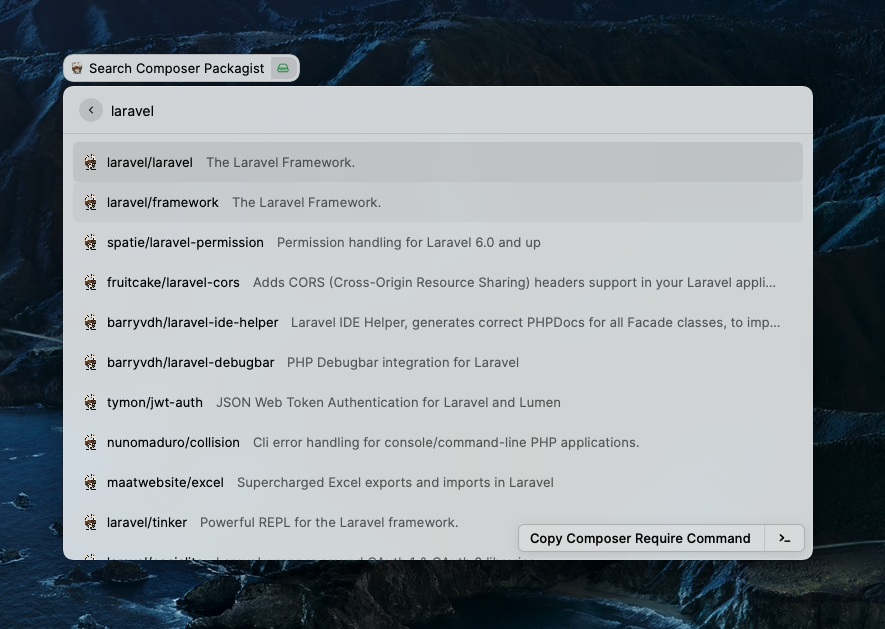

# Composer Packagist Documentation



Easy access to Composer Packagist from raycast

## Local setup

Run the following commands from the `composer-packagist` directory:

```sh
npm ci
npm run dev
```

`npm run dev` builds and imports the extension into Raycast, then watches for
changes. Open **Search Packages** in Raycast to use it. Press Ctrl+C in the
terminal when you no longer need the development watcher.

## Rebuild an installed extension

If Raycast shows `Missing executable. You might need to build the extension.`,
rebuild the command from this directory:

```sh
npm run build
```

On macOS, the build writes `composer.js` to
`~/.config/raycast/extensions/composer-packagist/`. Reopen **Search Packages**
after the build completes. The installed extension needs this compiled command
in addition to its `package.json` and assets; importing the manifest alone is
not sufficient. If dependencies are missing, run `npm ci` before building.
